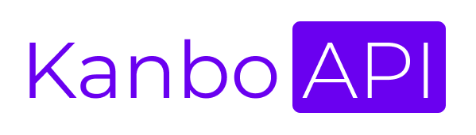

    

    
    
      

> This project is a WIP.

REST API for a kanban board application inspired by Trello. View the code for the front-end [here](https://github.com/danielcornock/kanbo-ui).

Features include organised columns with drag & drop functionality, linking github commits, tracked story numbers & custom tags & labels.

#### Board view

#### Edit story modal

#### Github config modal

### Technologies used

- NestJS
- TypeScript
- NodeJS
- Jest
- Express
